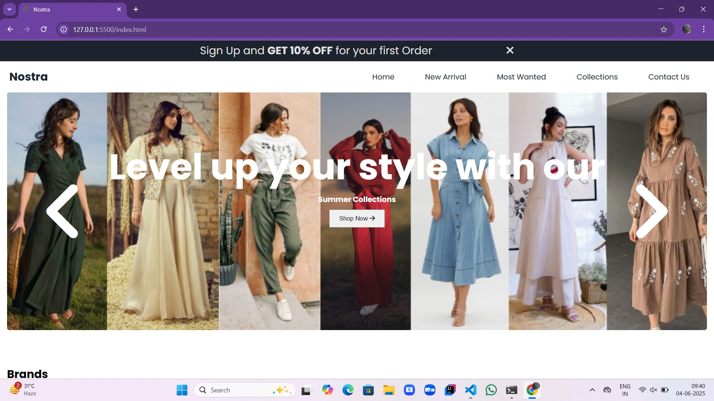
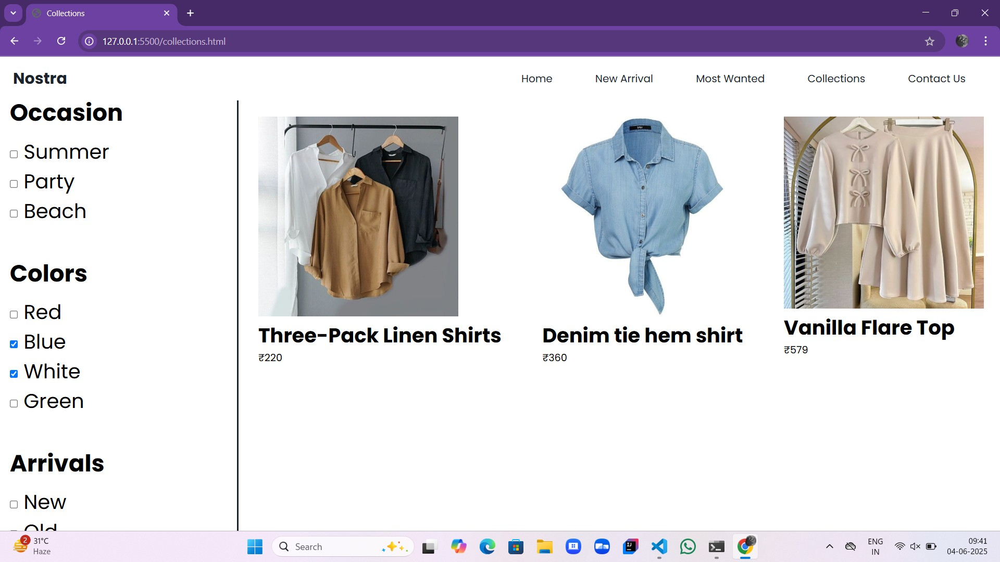
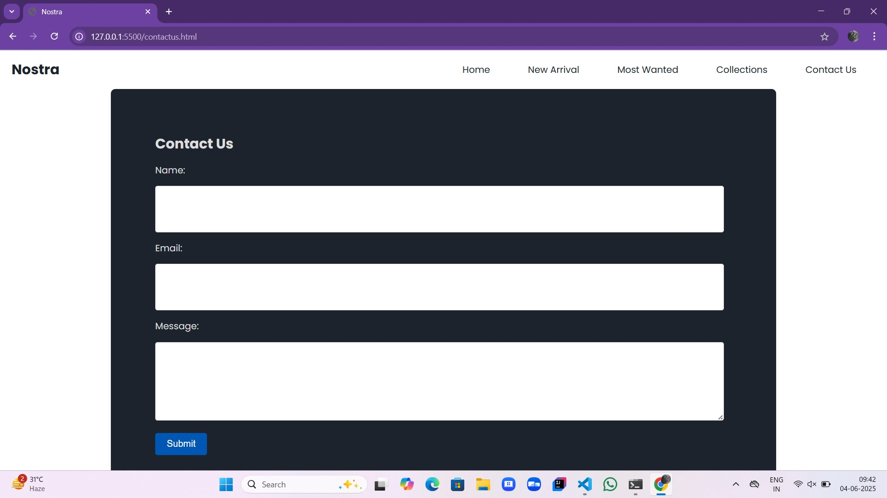
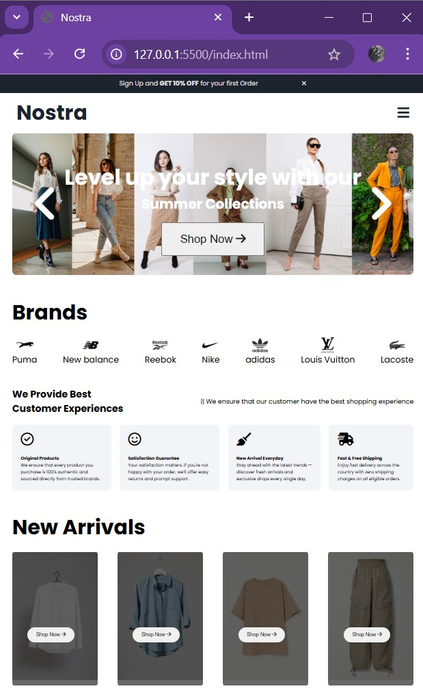
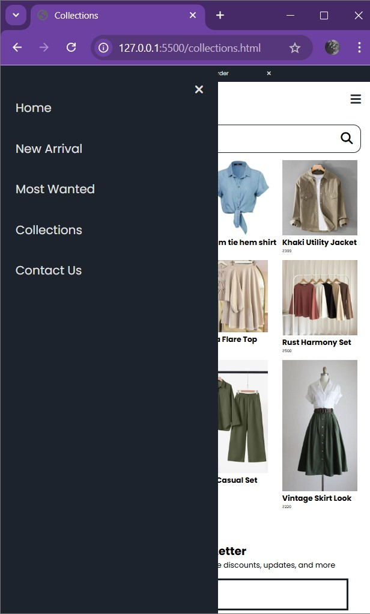

# 🛍️ NOSTRA

**NOSTRA** is a fully responsive, modern fashion e-commerce website built using **HTML**, **CSS**, and **JavaScript**. This project is designed to deliver an engaging, clean UI experience with seamless navigation and interactive sections.

## 🌟 Features

- **Landing/Home Page**

  - Hero slider
  - Promotional offer bar
  - New Arrivals & Most Wanted sections
  - Popular brand showcase

- **Collections Page**

  - Product cards with images, titles, and prices
  - Structured grid layout

- **Contact Us Page**

  - Form-style layout
  - Clean mobile-friendly design

- **Responsive Design**
  - Fully adapts to all screen sizes (desktop, tablet, mobile)

## 🧰 Technologies Used

- HTML5
- CSS3
- JavaScript
- Font Awesome
- Google Fonts

## 📁 Folder Structure

NOSTRA/
│
├── img/
│ └── products/
│ ├── f1.jpg
│ ├── f2.jpg
│ ├── f3.jpg
│ └── ... (f4 to f8)
│
├── Screenshots/
│ ├── brands.jpg
│ ├── collections.jpg
│ ├── contact.jpg
│ ├── footer.jpg
│ ├── Homepage.jpg
│ ├── mobileview.jpg
│ ├── mostwanted.jpg
│ ├── newarrivals.jpg
│ └── Responsiveview.jpg
│
├── index.html # Main home page
├── collections.html # Product collections page
├── contactus.html # Contact page
├── try.html # Additional/testing page
│
├── style.css # Main CSS styling file
│
├── JS/
│ ├── script.js # Core script (e.g., sliders, navbar)
│ ├── collections.js # JS for collections page
│ └── contact.js # JS for contact page
│
└── README.md # Project documentation

## 📸 Screenshots

### Home Page

### Collections Page

### Contact Page

### Responsive View

### Mobile View

## 👩‍💻 Author

**Developed by:** [Karthiga P](https://github.com/KarthigaP20)

## 🚀 Live Demo

[Live Link](https://karthigap20.github.io/Nostra-Js/)

## 💬 Feedback

If you have any suggestions or ideas to improve NOSTRA, feel free to reach out. Contributions are welcome!

Made with ❤️ using HTML, CSS, and JavaScript
